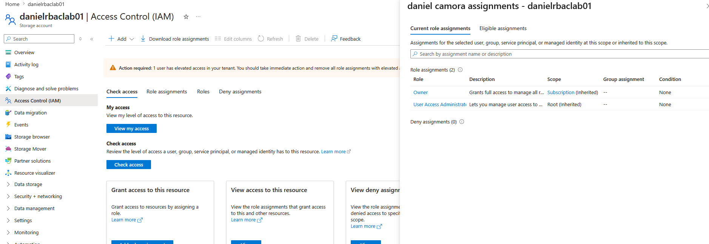
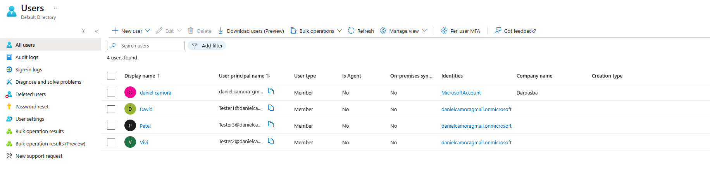
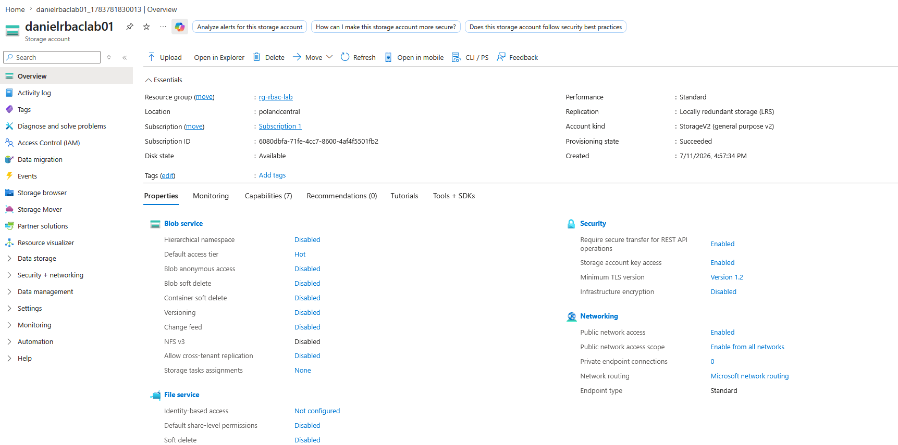
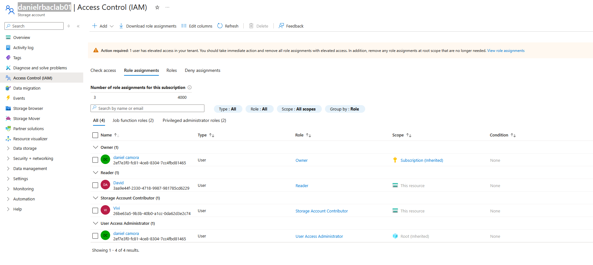
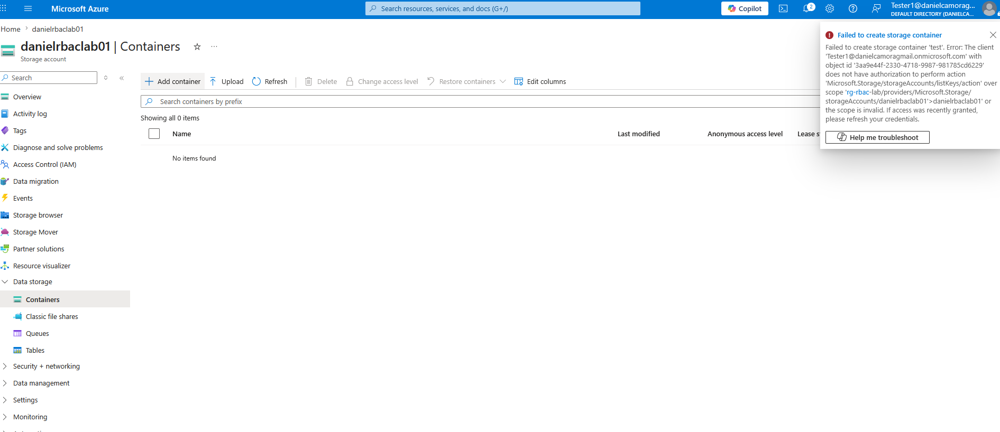
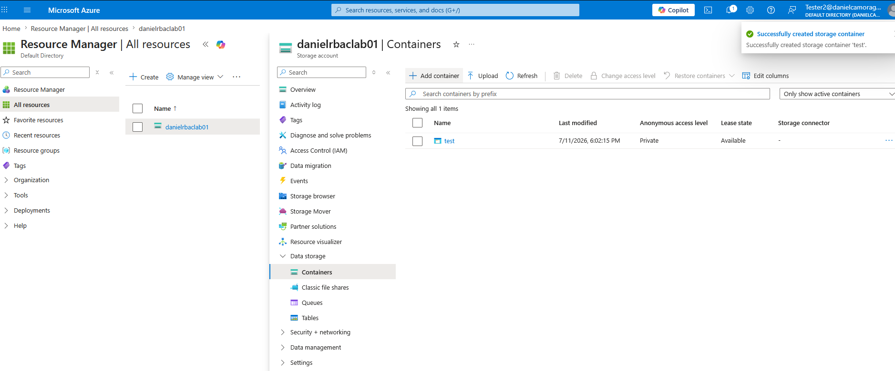

# Azure RBAC and Least Privilege Lab

## Overview
This lab was created to practice Azure RBAC and least privilege by assigning different levels of access to separate users on a specific storage account resource.

## Lab Goal
The goal of this lab was to check least privilege IAM in Azure by comparing what different users could do when assigned different roles on the same resource.

## Environment
- **Resource Group:** `rg-rbac-lab`
- **Storage Account:** `danielrbaclab01`
- **Region:** `Poland Central`
- **Scope Tested:** This resource only (`danielrbaclab01`)

## Identities Used
- **Admin account:** My account, with inherited administrative access
- **Reader user:** David
- **Storage Account Contributor user:** Vivi

## Roles Assigned
- **David** → `Reader`
- **Vivi** → `Storage Account Contributor`

Both role assignments were applied at the **storage account resource scope**, not at the resource group or subscription scope.

## What Was Tested
This lab tested how Azure RBAC changes user capabilities when access is limited to a single resource.

I compared:
- a user with **Reader** access
- a user with **Storage Account Contributor** access
- my own account with inherited admin permissions

## Observations

### Reader
The Reader user could:
- view the storage account
- access the portal view for the resource

The Reader user could not:
- change IAM assignments
- modify the resource
- create storage containers

### Storage Account Contributor
The Storage Account Contributor user could:
- access the storage account
- create a blob container
- perform management actions on the storage account beyond Reader permissions

### Admin Account
My account had inherited elevated access:
- **Owner** inherited from subscription scope
- **User Access Administrator** inherited from root scope

This account was used only as the admin reference account for setting up and validating the lab.

## Least Privilege Result
This lab showed least privilege in practice.

- The **Reader** user had only view access and could not make changes.
- The **Storage Account Contributor** user had more permissions and was able to create a blob container.
- Access was limited to the **specific storage account resource**, which reduced unnecessary broader access.

## CLI Validation
I also used Azure CLI to validate the environment and role assignments.

Commands used included:
```bash
az account show --output table
az storage account list --output table
az storage account show --name danielrbaclab01 --resource-group rg-rbac-lab --output table
az storage account show --name danielrbaclab01 --resource-group rg-rbac-lab --query id --output tsv
az role assignment list --scope "/subscriptions/<subscription-id>/resourceGroups/rg-rbac-lab/providers/Microsoft.Storage/storageAccounts/danielrbaclab01" --output table
```

The CLI output confirmed:
- the correct subscription context
- the storage account existed
- role assignments were applied at the storage account scope

## Screenshots
## Screenshots














## Key Takeaways
- Azure RBAC controls what users can do on a resource.
- Scope matters just as much as the role itself.
- Reader permissions allow visibility without change.
- Storage Account Contributor permissions allow more operational control.
- Least privilege means assigning only the minimum access required for a task.

## Conclusion
This lab helped me understand how Azure RBAC works at resource scope and how least privilege can be applied in a practical way. By assigning different roles to separate users on the same storage account, I was able to observe the difference between view-only access and contributor-level access.
